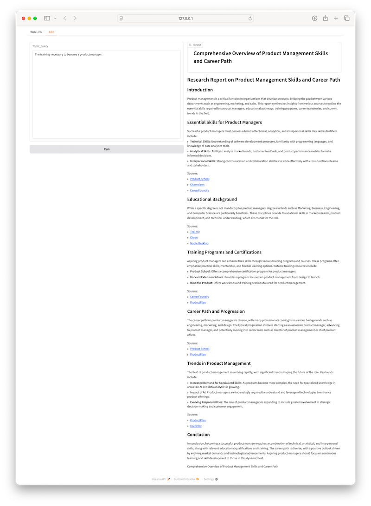

# Getting Started

AutoPlan is an open-source Python framework that provides a **powerful pattern for implementing agentic AI applications, leveraging dynamic plan generation to select and use external tools** based on the task's context.

Agentic AI applications are an emerging AI paradigm where LLMs use external tools to accomplish tasks that are beyond their own capabilities while keeping control over how to use those tools so that their abilities are not limited to predefined workflows. Building agentic applications requires a system design that allows plans to be dynamically generated, tools to be efficiently executed, and data flowing between tools to be properly channeled to provide a coherent output. AutoPlan provides just that.

AutoPlan is organized around three core components, each serving a specific purpose to enable dynamic planning, execution, and integration required for building an agentic application:

**Tools** can be any typed Python function — they can be procedural code, LLM calls, or AutoPlan applications themselves. Tools can be composed from smaller tools.

**Planners** are LLM-based components that generate the sequence of tools to be executed and the arguments to be passed to each tool to solve a given task. 

**Composers** integrate tool outputs based on the planner’s strategy to produce a final output.


## Key features

AutoPlan’s core functionality of dynamic planning shares similarities with the function calling feature found in major foundational models like [GPT](https://platform.openai.com/docs/guides/function-calling), [Claude](https://docs.anthropic.com/en/docs/build-with-claude/tool-use) and [Gemini](https://ai.google.dev/gemini-api/docs/function-calling). However, these models only return the functions (i.e., tools) to be called as a JSON object, leaving developers with several open questions: How should the models be prompted to generate an accurate plan that effectively uses the tools? How can the functions be executed efficiently? How should data flow between tools? How should the output of tools be summarized to generate the final output?

AutoPlan fully integrates dynamic planning and execution as a first-class capability, addressing these challenges:
- **Structured Inputs and Outputs:** AutoPlan leverages [Python type annotations](https://docs.python.org/3/library/typing.html) and [Pydantic](https://docs.pydantic.dev/latest/)  classes to specify tools with structured and typed inputs and outputs. This allows the planner to precisely understand how to interact with external tools and manage data flow effectively.
- **Planner Prompting:** AutoPlan provides a structured input and output format for plan generation, making it easy to apply best practices such as chain-of-thought reasoning and tool documentation injection. This ensures the Planner LLM receives high-quality inputs, which are essential for generating effective plans.
- **Efficient Execution:** AutoPlan’s orchestration layer automatically captures task interdependencies, identifies opportunities for parallel execution, and optimally executes tasks to minimize overall runtime latency.
- **Dataflow Management:** AutoPlan efficiently tracks and manages data dependencies, ensuring proper sequencing of tool executions and efficient transfer of outputs from upstream to downstream tasks.
- **Output composition:** AutoPlan supports generating the final output to meet application requirements by providing a pattern that allows developers to define how intermediate outputs from various tools should be composed.


Beyond dynamic planning and execution, AutoPlan provides developers with additional key benefits that improve usability, debugging, and flexibility in building and scaling their applications:

- **Streaming Output:** AutoPlan streams incremental results, such as the generated plan and the status of each step’s execution, enabling real-time progress tracking and user interfaces that display results as they are produced.
- **Observability:** AutoPlan enhances debugging, auditing, and monitoring through its robust logging capabilities, capturing inputs and outputs for all tools. It also supports multiple observability providers, including Weight & Biases, delivering out-of-the-box observability.
- **Extensibility:** Adding new tools is straightforward. Any typed Python function with a well written docstring can be a tool, making it easy to expand and customize your application.
- **LLM Agnostic:** AutoPlan integrates with LiteLLM, supporting a diverse range of LLM providers. This flexibility allows developers to experiment with and combine different models, enabling them to identify the best ones for their specific needs.


# Installation

AutoGen requires Python 3.12 or later.

## Using Pip

We recommend using a virtual environment manager to isolate the dependencies for AutoPlan. 

```
pip install -U autoplan
```

## Using Poetry

[Install Poetry](https://python-poetry.org/docs/#installation) if you don't already have it.

Create and activate:

```
poetry init
poetry shell

poetry add autoplan
```

# Deep dive through an example

To better understand the key features and functionalities of AutoPlan, let's go through a simple example that answers questions about the performance of stocks in the stock market. This is a type of application that an LLM cannot answer on its own because it requires downloading stock data. While incorporating stock data into an LLM application can be achieved with the RAG pattern, the quality of the results can be further improved by using additional tools to compute certain metrics to have a more comprehensive analysis. The adddition of such tools in the answer generation pipeline and the way they should be used in terms of which stock data should be downloaded, which metrics should be computed, and how they should be combined based on the user's specific question calls for a certain level of orchestration where static workflows fall short.

## Main components

Let's start by looking at the a simple example where the user asks how Nvidia's stock performs compared to Alphabet's and Amazon's. This question gets fed into the planner along with the list of tools available to the application. Here's is an excerpt from the planner prompt:

```
Generate a plan to answer the user's query about stock market benchmarks.
...
You will be probided with a list of additional tools to reason abuot the user's query. 
You must use these tools provided to generate the best plan possible to answer the user's query.
        
The list of tools and how to use them is defined by the json schema below:
{execution_context.plan_class.model_json_schema()}

Apply the following plan to solve for the user's query:
- Download the data for the tickers that are relevant to the user's query.
- Run the calculate statistics tool for every downloaded ticker data.
...
The user's query: " + application_args["question"]
```

The set of tools available to the planner is defined by an annotation attached to the application as follows:

```python
@with_planning(
    tools=[
        download_ticker,
        calculate_statistics,
    ]
    generate_plan_prompt_generator=generate_plan,
    combine_steps_prompt_generator=combine_steps,
)
```

Tools are defined with the `@tool` decorator and are annotated with the expected input and output types. They can optionally declare dependencies on certain data types which can be generated by other tools, such that the planner can generate a plan that uses the tools in the right order. Note that it is very important to add docstrings to the tool methods because these inform the planner on the tool's capabilities and how to use it.

```python
@tool
async def download_ticker(ticker: str) -> TickerData:
    """
    Given a ticker, download the data from yfinance for the past 5 years in monthly frequency.
    Args:
        ticker: The ticker symbol of the stock to download data for.
    Returns:
        TickerData: Object containing the downloaded stock data.
    """
    data = yf.download(ticker, period="5y", interval="1mo")
    return TickerData(
        name=ticker,
        closes=[cell[0] for cell in data["Adj Close"].values.tolist()],
    )


@tool(can_use_prior_results=True)
def calculate_statistics(data: TickerData) -> Statistics:
    """
    Calculate the statistics for the given stock data.

    Args:
        data: TickerData from a prior step containing closing prices

    Returns:
        Statistics: Object containing calculated statistics including:
            - name: Name of the ticker/benchmark
            - one_month_return: Percentage return over last month
            - one_year_return: Percentage return over last year
            - volatility: Standard deviation of the monthly returns
            - sharpe_ratio: Sharpe ratio of the monthly returns
    """
    ...
```

Finally, you can give a prompt for the composer to combine the results provided by the tools to generate the final answer. There's a lot of flexibility in how you can define this prompt, but in this example, we'll use a simple prompt that combines the results of the tools into a single answer.

```
Summarize the results coming out of the tool executions in the following way:
1. Answer the user's query, explaining the rationale behind the metrics and data used.
2. Explain the meaning of the metrics and basis for the benchmark comparison.
```

## Running the application

To run the application, follow these steps:
```
cd examples/stock_market_expert
poetry install
OPENAI_API_KEY=<your-api-key> poetry run python stock_benchmark/app.py
```

Once you run the application using the above command lines, you will see a Gradio interface that allows you to interact with the application.
Now you can type in the question "How does Nvidia's stock perform compared to Alphabet's and Amazon's?" and see its answer.


Below is a likely plan that would be generated by the planner to answer this question:


The above question refers to specific stocks, making it an easier task to generate a plan. Since the plan is generated by an LLM, you can also ask questions that require domain and common sense knowledge to answer the user's question. For example, if you ask "Compare Nvidia's performance against the market", you can expect the planner to generate a plan that downloads data from major stock market indices to build up a baseline for comparison.


## Takeaways

From an **architectural perspective**, this execution pattern allows the **decomposition of the problem into smaller, more modular parts**. This is a powerful pattern that allows the application to be highly flexible and modular, and to be easily extended with new tools or parts of the application.

From a **performance perspective**, it is important to note that the **tools start executing as soon as the first steps of the plan are generated**, without necessarily waiting for the entire plan to be generated. This is achieved by streaming the output of the planner to the executing engine and the execution engine starting taks in an eager manner. Second, the **execution engine is able to execute the tools in parallel where possible**, such as when the tools are not dependent on the output of each other. These two features combined allows the application to be highly performant and to provide responses as quickly as possible.

From an **observability perspective**, the application **logs all inputs and outputs for all tools, making debugging, auditing, and monitoring straightforward**. For example, you can try running the application with an additional environment variable (e.g. `WEAVE_PROJECT_ID="Stock"`) for logging and observing the execution pipeline through Weights & Biases.


# Bootstrapping your own application

AutoPlan has a command-line interface that allows you to create a new application. To create your own application, you can use the following command:

```bash
autoplan generate \
  --name "my_app" \
  --description "This is an LLM-powered tool that can generate a research report on a topic of interest based on a user query." \ 
  --outdir .
```

> [!NOTE]
> You must have `AutoPlan` installed to use this command.

Note that you can also leave the parameters empty and let the CLI prompt you for the information, which will help you get started with bootstrapping your application.

This command line will create a new folder named `my_app` with the basic structure of an AutoPlan application. You can then go in the application folder and run it with the following command:

```bash
cd my_app
poetry install
poetry run python my_app/app.py
```

This will start a Gradio interface that allows you to interact with the application without any additional effort. You can now use your browser and go to `http://localhost:7860` to see the application.



> [!NOTE]
> By default AutoPlan will use Open AI models and will include a search tool based on [you.com](http://api.you.com), which require API keys. You can set the `OPENAI_API_KEY` and `YDC_API_KEY` environment variables to your OpenAI and You API keys to use your own accounts .


# Best practices

Here are a few best practices to follow to get the best out of your own AutoPlan applications.

## Create reusable tools

One of the key features of AutoPlan is the ability to create tools that can be reused accross different scenarios. When designing your application, think about how to decompose the problem into smaller, more modular parts and how to parameterize so that the planner can use them in different contexts.

## Add docstrings to tool methods

The planner needs to know how to use the tools to generate a plan that uses the tools in efficient and effective ways. For this reason, it is very useful to add information about how to use the tools in the planners prompt. 

To do this systematically, AutoPlan's execution context provides an interface to generate a JSON schema of the tools (i.e. `{execution_context.plan_class.model_json_schema()}`), which is highly recommended to be injected into the planner prompt. This interface relies on the docsrtings. It is important to add comprehensive docstrings to the tool methods to make sure that the planner can generate a plan that uses the tools in the right way.

```python
class SearchResult(BaseModel):
    content: str = Field(..., description="The content of the search result.")
    sources: list[str] = Field(..., description="The links to the search result pages.",
    )
```

## Use typed I/O for tools

The composition of an application based on multiple tools requires the data to flow between the tools. To make sure that the data that is produced by one tool can be used by another tool, it is important to type the I/O of the tools. This is achieved by using Pydantic models to define the input and output types of the tools. It is equally important to add field descriptions to the Pydantic models to make sure that the planner can generate a plan that uses the tools in the right way.


```python
@tool
async def download_ticker(ticker: str) -> TickerData:
    """
    Given a ticker, download the data from yfinance for the past 5 years in monthly frequency.
    Args:
        ticker: The ticker symbol of the stock to download data for.
    Returns:
        TickerData: Object containing the downloaded stock data.
    """
    ...
```


## Manage static dependencies

Sometimes the tools need to access to certain parameters that don't need to be generated by the planner. For example, a tool may need a direct access to the user's query. To achieve this, you can add a `Dependency` object as an argument to the tool method and initialize it in the application.


```python
# Declare a dependency object
from autoplan import Dependency
query_dependency = Dependency()

# Declare a tool that uses the dependency object with a default value
@tool
def analyse_query(user_query:Dependency = query_dependency) -> QueryAnalysis:
    ...

# Set the value of the dependency object in the application code where you have access to the user's input text field
query_dependency.set(input_text.value)
```

## Optimize the order of I/O fields

Chain-of-thought reasoning is a powerful prompt engineering technique that enhances LLM performance by generating intermediate reasoning steps to guide the final output. This approach improves coherence and accuracy by conditioning subsequent outputs on earlier generated tokens.

You can apply this technique effectively by optimizing the order of input/output (I/O) fields in Pydantic models to encourage structured reasoning.

For example, AutoPlan's default data class, which defines the planner's output, is structured as follows:

```python
class Step(BaseModel):
    """
    A step in the plan, using a specific tool.
    """

    tool_call: Tool


class Plan(BaseModel):
    """
    A plan for achieving the application's goal, composed of steps.
    """

    rationale: str = Field(
        description="Layout a detailed rationale for the plan, detailing step by step the tools that should be called, where their inputs should come from, and how the results can be used."
    )
    steps: Sequence[Step]
```

In this example, while only the `steps` field is strictly required to execute the plan, including a `rationale` field before the steps provides additional context. This textual description encourages the planner to produce a well-reasoned and logically sound plan, increasing the likelihood of success.

## Decompose tools as AutoPlan applications

AutoPlan allows tools to be defined as AutoPlan applications themselves. Indeed, any AutoPlan application can be used as a tool by other AutoPlan applications. This allows for a high level of modularity and reusability of tools. 

As illustrated in the example below, The `story_description` is an AutoPlan application that uses `create_character` as a tool. `create_character` is itself an AutoPlan application that uses `you_search` as a tool in order to search for information about the character on the web.

```python
@with_planning(
    step_class=CharacterPlanStep,
    plan_class=CharacterPlan,
    tools=[you_search],
    generate_plan_prompt_generator=generate_plan,
    combine_steps_prompt_generator=combine_steps,
)
async def create_character(
    character_request: str,
) -> CharacterOutput:
    ...

with_planning(
    step_class=StoryPlanStep,
    plan_class=StoryPlan,
    tools=[create_character],
    generate_plan_prompt_generator=generate_plan,
    combine_steps_prompt_generator=combine_steps,
)
async def run(
    story_description: str,
) -> StoryOutput:
    pass
```

## Try using different LLMs

You can try using different LLMs by setting the `generate_plan_llm_model` and `combine_steps_llm_model` parameters in the `with_planning` decorator, and/or by setting the model of your choice in your tool implementations. 

```python
@with_planning(
    generate_plan_llm_model="claude-3-5-sonnet-latest",
    combine_steps_llm_model="claude-3-5-sonnet-latest",
)
```

If your application uses other models, you should set the API keys for those models in your environment (e.g. `ANTHROPIC_API_KEY = <your-key>`) .

----